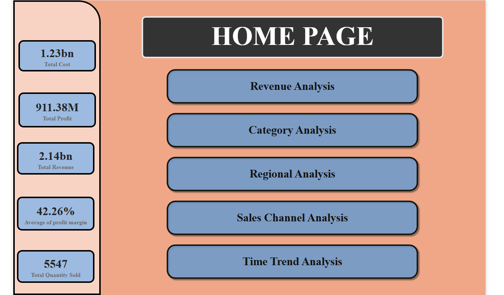
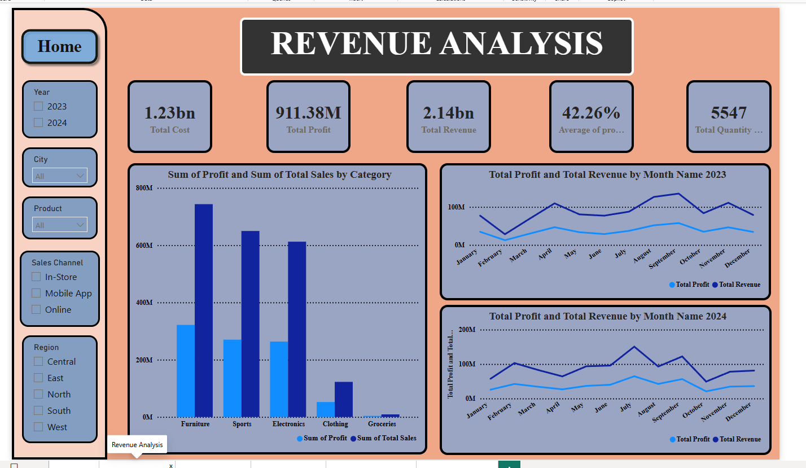
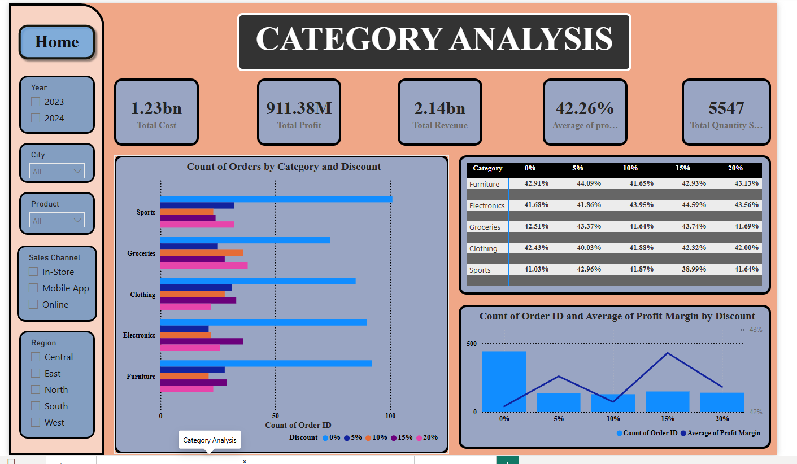
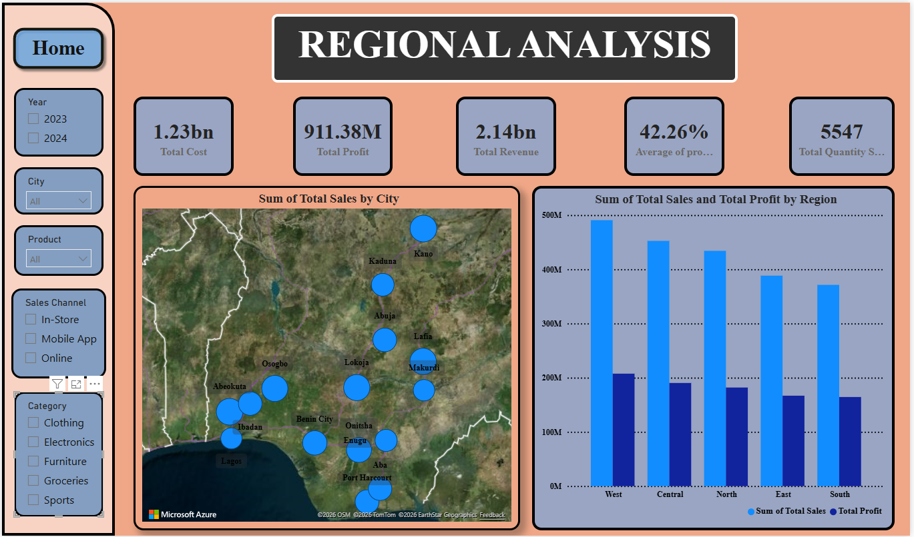
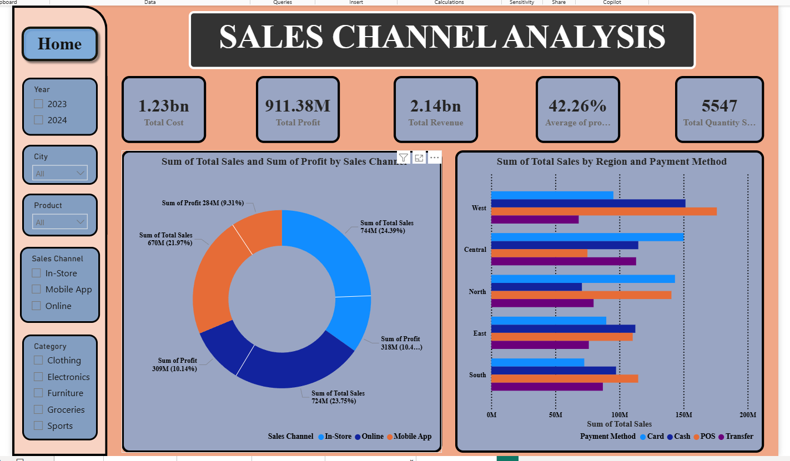
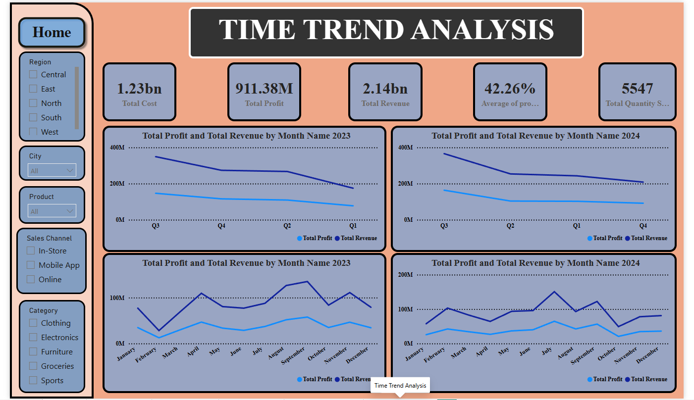

# 🛒 Retail Sales Analysis
**Tools:** Power BI · Power Query · DAX · Excel  
**Period Covered:** 2023 – 2024  
**Status:** Complete ✅

---

## 📌 Project Overview

A comprehensive end-to-end retail sales analysis covering revenue performance, product category behaviour, regional trends, sales channel efficiency, and time-based patterns across 2023 and 2024. Built as a fully interactive six-page Power BI dashboard with slicers for Year, City, Product, Sales Channel, Region, and Category — enabling drill-down analysis at every level.

Deliverables include the interactive Power BI dashboard, a full written report, and a PowerPoint presentation.

---

## 📊 Key Metrics

| Metric | Value |
|--------|-------|
| Total Revenue | ₦2.14 Billion |
| Total Profit | ₦911.38 Million |
| Total Cost | ₦1.23 Billion |
| Average Profit Margin | 42.26% |
| Total Quantity Sold | 5,547 units |
| Period | 2023 – 2024 |

---

## 🗂️ Dashboard Pages

### 1. 🏠 Home Page
Executive summary with headline KPIs and navigation to all five analytical pages.



---

### 2. 💰 Revenue Analysis
Profit and revenue breakdown by product category with dual year-over-year monthly trend lines for 2023 and 2024.

**Key visuals:**
- Sum of Profit and Total Sales by Category (clustered bar)
- Monthly revenue and profit trend — 2023 vs 2024



---

### 3. 📦 Category Analysis
Deep dive into order volume, discount impact, and profit margins across all five product categories.

**Key visuals:**
- Orders by Category and Discount level (grouped bar)
- Profit margin % by category and discount tier (matrix table)
- Average profit margin vs order count by discount level (combo chart)

**Notable insight:** Profit margins remain relatively stable (~42%) across discount tiers (0%–20%), suggesting discounting is not significantly eroding profitability at current levels.



---

### 4. 🗺️ Regional Analysis
Revenue and profit performance broken down across five regions — West, North, South, East, and Central.

**Key visuals:**
- Regional map visual
- Total Sales and Profit by Region (clustered bar)

**Key finding:** West and North regions lead in both total sales and profit.



---

### 5. 📡 Sales Channel Analysis
Revenue and profitability split across In-Store, Online, and Mobile App channels — with regional payment method breakdown.

**Key visuals:**
- Sales and profit share by channel (donut chart) — Online leads at 24.39% of total sales
- Total sales by region and payment method (stacked bar)

**Notable insight:** All three channels show similar profit contributions (~10% each), suggesting no single channel is significantly outperforming others on margin.



---

### 6. 📅 Time Trend Analysis
Monthly and quarterly revenue and profit trends across 2023 and 2024 — side by side for direct year comparison.

**Key visuals:**
- Quarterly trend lines (2023 vs 2024)
- Monthly trend lines (2023 vs 2024)

**Key finding:** Both years show a consistent revenue dip in Q1, with recovery through Q2–Q3. 2024 follows a similar seasonal pattern to 2023.



---

## 🛠️ Tools & Techniques

| Tool | Purpose |
|------|---------|
| Microsoft Excel | Raw data storage and initial exploration |
| Power Query | Data cleaning, transformation, and Star Schema modelling |
| Power BI | Dashboard development, interactivity, and visualisation |
| DAX | Calculated measures — profit margin %, YoY comparisons, totals |
| Microsoft PowerPoint | Presentation of findings |
| Microsoft Word | Written analysis report |

**DAX concepts applied:**
- `CALCULATE` with filter context
- Time intelligence measures (monthly, quarterly, YoY)
- Profit margin % as a calculated measure
- Custom aggregations across slicers

---

## 📁 Repository Contents

```
retail-sales-analysis/
│
├── README.md                      ← You are here
├── Retail_Sales_Analysis.xlsx     ← Raw dataset
├── Retail_Sales_Report.docx       ← Full written report
├── Retail_Sales_Presentation.pptx ← PowerPoint presentation
└── images/
    ├── home_page.png
    ├── revenue_analysis.png
    ├── category_analysis.png
    ├── regional_analysis.png
    ├── sales_channel_analysis.png
    └── time_trend_analysis.png
```

---

## 🔗 Links

- 📊 [View Full Project on Google Drive](https://drive.google.com/drive/folders/1gzlVJ3aWLbNW5Qhim_GOT4ybVZoQLIbQ?usp=drive_link)
- 🌐 [Portfolio Website](https://oluwadamilare-sulemana.github.io)
- 💼 [LinkedIn](https://www.linkedin.com/in/sulemana-oluwadamilare-16a243284)

---

*Project by [Oluwadamilare Sulemana](https://www.linkedin.com/in/sulemana-oluwadamilare-16a243284) — Data Analyst | Lagos, Nigeria*
